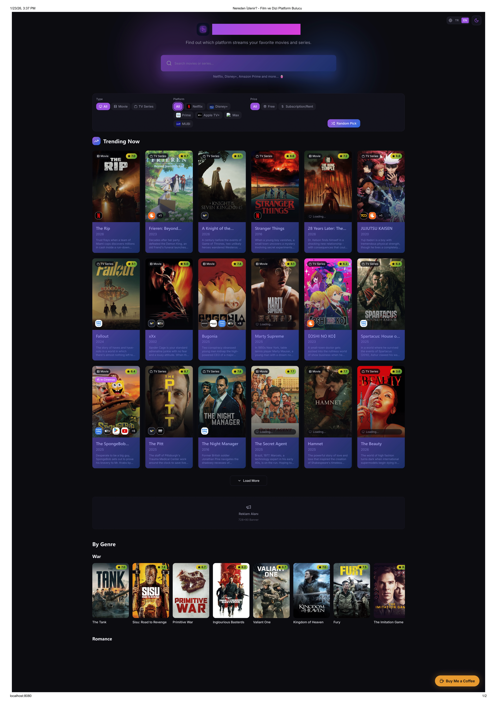

# 🎬 Where to Watch

Kullanıcıların film ve dizilerin hangi yayın platformlarında (Netflix, Disney+, Apple TV, vb.) olduğunu bulmalarını sağlayan modern bir rehber uygulaması. **TMDB API** entegrasyonu ile anlık ve gerçek veriler sunar.

### Ana Sayfa



### Giriş Ekranı


## ✨ Öne Çıkan Özellikler

- **TMDB Entegrasyonu:** Dünya çapındaki en geniş film/dizi veritabanından anlık veriler.
- **Platform Takibi:** JustWatch verileriyle entegre platform bilgileri (Hangi içerik nerede?).
- **Dinamik Sliderlar:** En çok izlenen ve trend olan içerikler için interaktif kaydırıcılar.
- **Hızlı Arama:** Optimize edilmiş arama algoritması ile saniyeler içinde sonuç.
- **Responsive Tasarım:** Tailwind CSS ile tüm cihazlarda (Mobil/Tablet/Desktop) kusursuz görünüm.

## 🛠️ Kullanılan Teknolojiler

- **Frontend:** [React](https://react.dev/) + [Vite](https://vitejs.dev/)
- **Dil:** [TypeScript](https://www.typescriptlang.org/)
- **Stil:** [Tailwind CSS](https://tailwindcss.com/)
- **UI Bileşenleri:** [shadcn/ui](https://ui.shadcn.com/)
- **API:** [The Movie Database (TMDB)](https://www.themoviedb.org/documentation/api)

## 🚀 Kurulum ve Yerel Çalıştırma

Projeyi kendi bilgisayarınızda çalıştırmak için aşağıdaki adımları izleyin:

1.  **Projeyi Klonlayın:**

    ```bash
    git clone [https://github.com/kullanici-adin/where-to-watch.git](https://github.com/kullanici-adin/where-to-watch.git)
    cd where-to-watch
    ```

2.  **Bağımlılıkları Yükleyin:**

    ```bash
    npm install
    ```

3.  **API Anahtarını Ayarlayın:**
    Projenin ana dizinine `.env` adında bir dosya oluşturun ve TMDB'den aldığınız API anahtarını ekleyin:

    ```env
    VITE_TMDB_API_KEY=buraya_api_anahtarinizi_yazin
    ```

4.  **Uygulamayı Başlatın:**
    ```bash
    npm run dev
    ```
    Tarayıcınızda `http://localhost:5173` adresine giderek projeyi görebilirsiniz.

## 📝 Notlar

- Bu proje başlangıçta bir prototip olarak Lovable ile oluşturulmuş, daha sonra manuel olarak optimize edilip TMDB API ile güçlendirilmiştir.
- API anahtarınızı güvenli tutmak için `.env` dosyasını asla GitHub'a göndermeyin (`.gitignore` dosyasında ekli olduğundan emin olun).

## 📄 Lisans

Bu proje [MIT](https://opensource.org/licenses/MIT) lisansı ile korunmaktadır.
